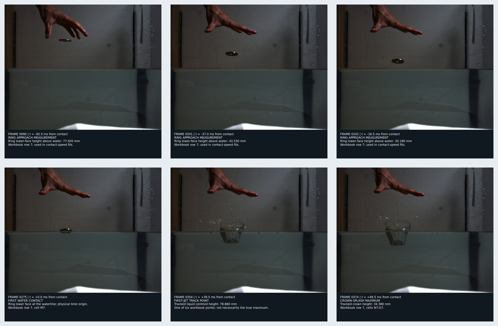
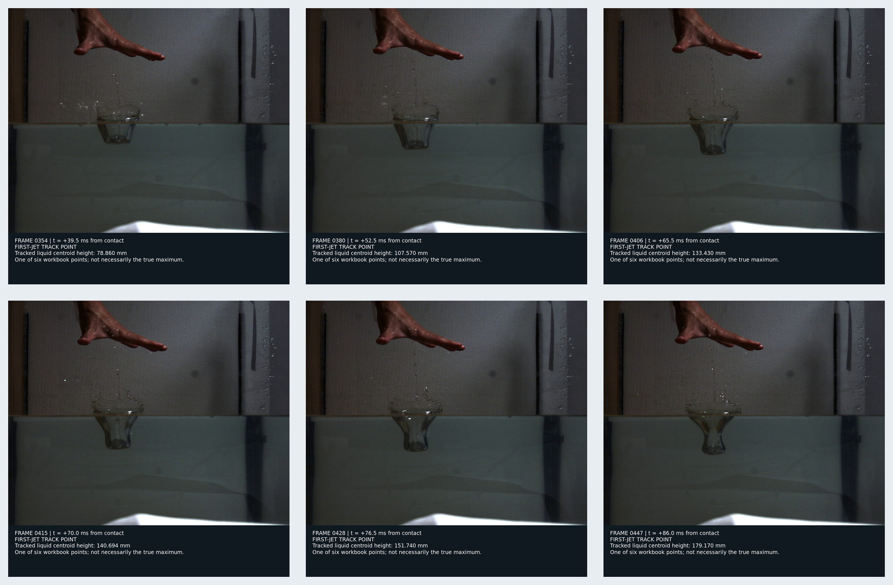
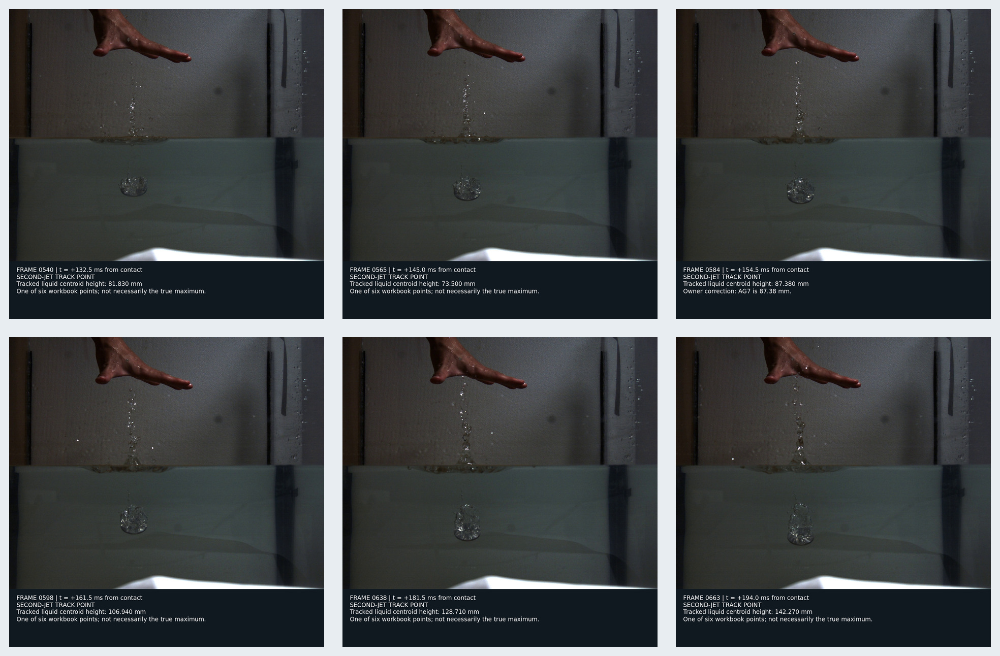
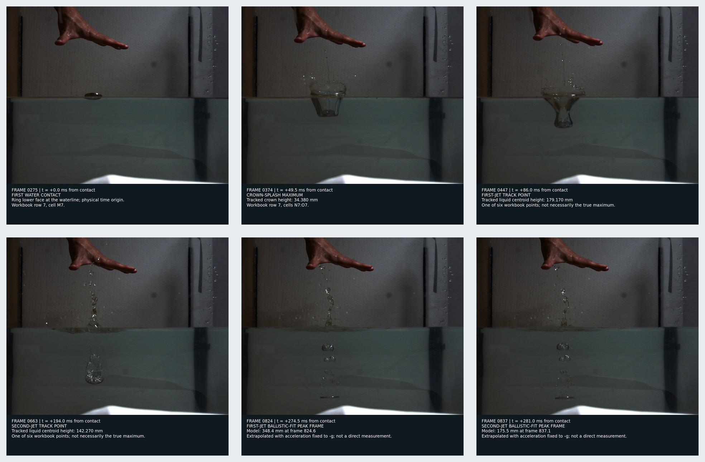

# Row-7 ideal ring-entry example

Status: **owner-designated representative experiment; atlas and calculations
prepared for Case 18 intake**.

This example is workbook row 7 (`group 2`, `repeat 1`). It uses the same
nominal specimen family as Case 12: inner radius `5.05 mm`, outer radius
`20.07 mm`, thickness `2.86 mm`, and measured mass `26.15 g`. It is a new
1584-frame video, not the earlier 660-frame Case 12 sequence.

## Quick visual review

### Ring approach, contact, and crown



### Six first-jet track points



### Six second-jet track points



### Key events and fitted peak frames



The last two panels in the fourth sheet are decoded video frames nearest the
ballistic fitted peak times. They are not additional height measurements and
do not prove that the visible liquid belongs uniquely to either fitted track.

## Source and timing

The owner-supplied sources remain read-only on the Windows `E:` drive and are
not copied into Git:

- `_Ring_Inner_r5.05mm_Ring_outter_R20.07mm_Ring_Thickness_2.86mm_Ring_mass_26.15g_video__C001H001S0001.mp4`, SHA256 `dcc451a854ee9ea6ac8ae4636aacec753863bd2868254f73148a5844795b80f2`;
- `数据记录表_一次与二次射流六点轨迹版.xlsx`, SHA256 `770ee400b2bf4650ed9b87b13af2ea8c013da7b72659feeb230cb92ffbf20136`.

The MP4 is H.264, `1280 x 1024`, 1584 frames, and encoded for 30 fps playback.
Physical timing follows the experiment protocol's `2000 fps` capture rate.
Workbook frame 275 is first contact, hence

`t_physical = (frame - 275)/2000 seconds`.

`source_lock.tsv` freezes both hashes and paths. `frame_index.tsv` maps every
selected zero-based decoder frame to its physical time, role, exact raw PNG,
annotated derivative, and hashes.

## Row-7 measurements

- Ring approach: `77.92 mm @ frame 90`, `43.53 mm @ frame 201`, and
  `20.18 mm @ frame 242`, measured as lower-face height above water.
- First contact: frame `275`.
- Crown maximum: `34.38 mm @ frame 374`, or `49.5 ms` after contact.
- First-jet six-point heights rise from `78.86 mm @ frame 354` to the largest
  sampled value `179.17 mm @ frame 447`.
- Second-jet six-point heights span `73.5--142.27 mm` over frames `540--663`.
  The owner corrected workbook cell `AG7` to `87.38 mm`; the raw workbook text
  includes the mistyped unit suffix, but all derived tables use millimetres.

The complete sorted transcription is `row7_observations.tsv`. The six-point
values are liquid-centroid tracks, not direct measurements of a continuous
column envelope and not necessarily the true maxima.

## Calculations

For the main approach estimate, acceleration is fixed to Shenzhen normal
gravity `g=9.78792 m/s2` (WGS-84 latitude `22.54 deg`, near sea level), and the
contact position is fixed at zero. Least squares over the three approach
points gives:

- contact speed `1.303691882 m/s`;
- position RMSE `1.239498 mm`;
- equivalent vacuum release-height scale `86.821946 mm`.

A two-parameter diagnostic fit gives `1.373456977 m/s` and effective
acceleration `11.468598 m/s2` with `0.623947 mm` RMSE. The latter acceleration
is not physically accepted for Shenzhen and must not be used as gravity or as
a Case 18 input; it only records the residual curvature preferred by these
three image measurements.

For a compact extrapolation of each six-point liquid-centroid track, vertical
acceleration is fixed to `-g`. This gives:

| track | fitted peak frame | time after contact | fitted peak height | six-point RMSE |
| --- | ---: | ---: | ---: | ---: |
| first jet | 824.557 | 274.779 ms | 348.425 mm | 3.008 mm |
| second jet | 837.147 | 281.073 ms | 175.547 mm | 8.662 mm |

Both peaks are model extrapolations beyond their six input points. They are
useful provisional Case 18 comparison targets, but the observed point tables
remain the primary evidence. `row7_calculations.tsv` is the machine-readable
authority for every fitted value and assumption.

## Directory map

- `raw/`: 19 exact lossless source-frame decodes without overlays;
- `annotated/`: corresponding full frames with timing and evidence captions;
- `sheets/`: four review montages embedded above;
- `frame_index.tsv`: frame/file/hash provenance;
- `row7_observations.tsv`: sorted workbook-row transcription;
- `row7_calculations.tsv`: approach and ballistic-fit results;
- `source_lock.tsv`: source hashes and evidence boundary.

## Reproduction

From the repository root:

```sh
python3 cases/12_video_26p15g_calibration/tools/build_row7_example.py \
  '/mnt/e/释放装置/_Ring_Inner_r5.05mm_Ring_outter_R20.07mm_Ring_Thickness_2.86mm_Ring_mass_26.15g_video__C001H001S0001.mp4' \
  '/mnt/e/释放装置/数据记录表_一次与二次射流六点轨迹版.xlsx' \
  cases/12_video_26p15g_calibration/experiment_examples/row7_ideal_entry
```

The builder uses only Python standard-library modules plus the already frozen
`ffmpeg` and ImageMagick tools. It verifies both source hashes and the row-7
cell values before regenerating any derivative.

## Evidence and rights boundary

The original MP4 and XLSX are owner-contributed laboratory evidence and remain
outside Git. The owner's request authorizes these selected decoded frames and
project-created annotations for repository collaboration, but does not grant a
general third-party media license. Quantitative work must use the raw frames
and TSV files, not the captioned JPEGs.
