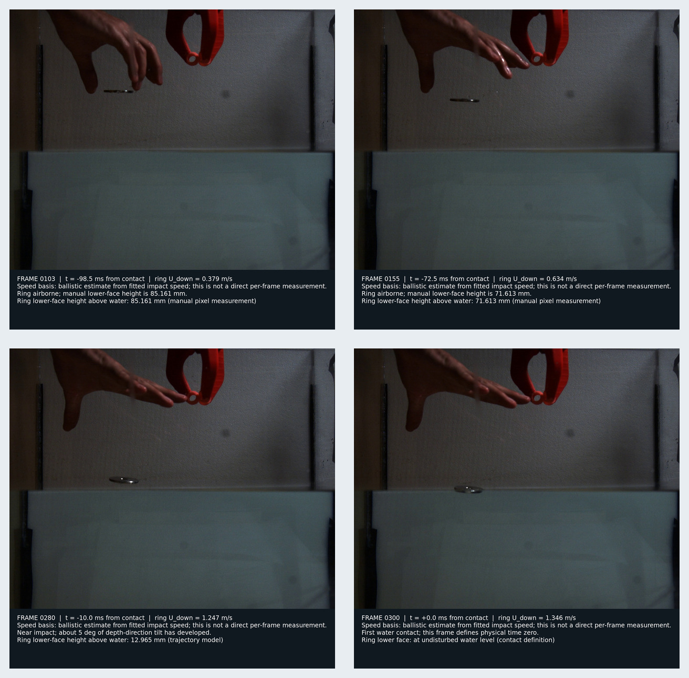
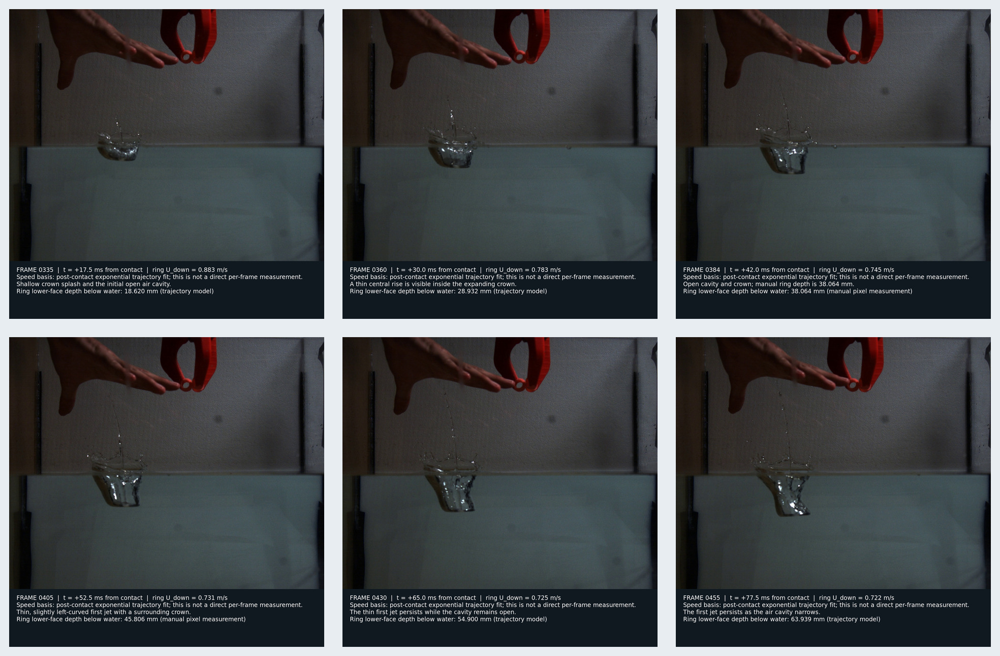
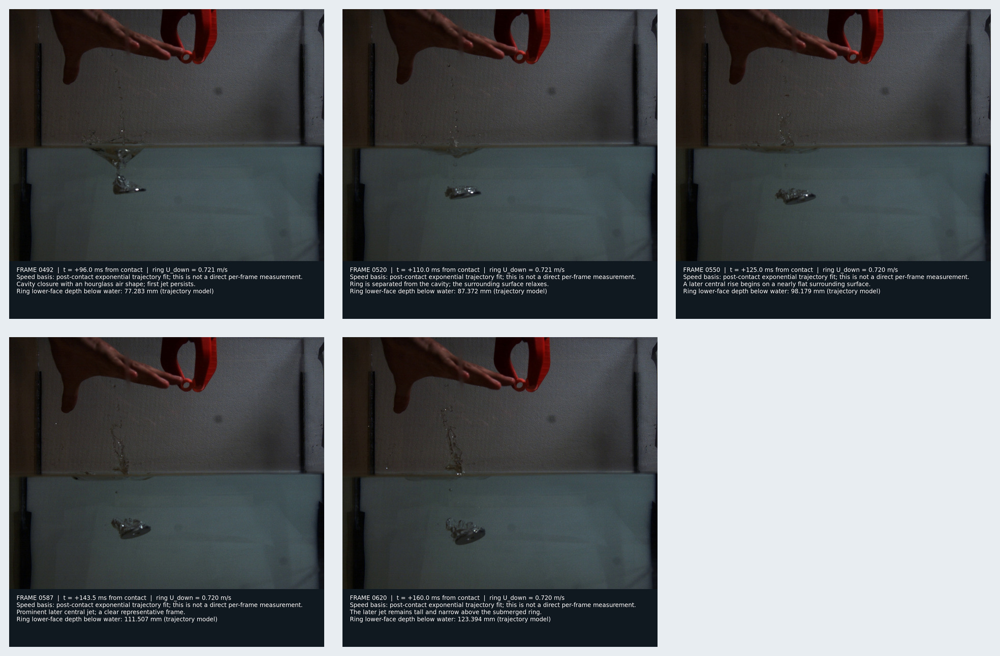
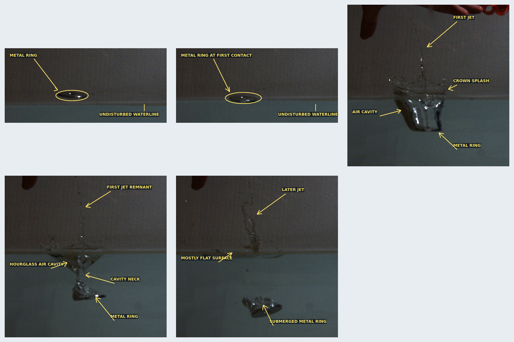

# Laboratory key-frame atlas

Status: **prepared for project-owner human review; labels are provisional until
that review is accepted**.

This directory makes the observed ring entry visible in the repository rather
than reducing the experiment to trajectory numbers. It contains 15 exact
decoded source frames, 15 captioned frames, five enlarged object/phenomenon
callouts, and four overview sheets. The complete slowed video is deliberately
not copied into Git.

## Quick visual review

### Approach and first contact



### Early entry and first jet



### Cavity closure and later jet



### Object and phenomenon callouts



The object callouts identify the metal ring, undisturbed waterline, first
contact, crown splash, open air cavity, first jet, hourglass closure, cavity
neck, and later central jet. They are observation labels, not claims about the
mechanism that creates either jet.

## Source and timing

The source is the project-owner-supplied file
`Ring_Inner_r5.05mm_Ring_outter_R20.07mm_Ring_Thickness_2.86mm_Ring_mass_26.15g_C001H001S0001.mp4`.
Its frozen SHA256 is:

```text
c5982c4ee7c2332d9798de1cc61a57400bb9acb694d9bfbb5473dba189ab8c07
```

The encoded file has 660 frames at 1280 x 1024 and 30 fps playback. Physical
timing uses the supplied original capture rate of 2000 fps, so one source frame
is 0.5 ms. Frame 300 is the supplied first-contact time origin:

```text
t_physical = (frame - 300)/2000 seconds
```

For exact reproducibility, the stored frame number is the zero-based decoder
index used by `ffmpeg`'s `select=eq(n,frame)` expression. The selected frame
300 visually matches the supplied first-contact description; the review below
also asks the owner to confirm that convention.

The speed printed on each caption is **not a direct per-frame velocity
measurement**. Before contact it is a ballistic estimate from the fitted
impact speed. After contact it is the already documented exponential
trajectory fit to the manually measured ring positions. Only frames 103, 155,
384, and 405 have direct manual pixel-position labels; all other positions are
trajectory-model values.

## Selected frames

| frame | time from contact | fitted down speed | role | visible observation |
| ---: | ---: | ---: | --- | --- |
| 103 | -98.5 ms | 0.379 m/s | trajectory fit | Airborne ring; manually labelled lower face 85.161 mm above water. |
| 155 | -72.5 ms | 0.634 m/s | trajectory fit | Airborne ring; manually labelled lower face 71.613 mm above water. |
| 280 | -10.0 ms | 1.247 m/s | geometry limit | Ring near the water; depth-direction tilt has developed. |
| 300 | 0.0 ms | 1.346 m/s | time origin | First water contact. |
| 335 | +17.5 ms | 0.883 m/s | holdout | Shallow crown splash and initial open air cavity. |
| 360 | +30.0 ms | 0.783 m/s | holdout | Thin central rise inside the expanding crown. |
| 384 | +42.0 ms | 0.745 m/s | trajectory fit | Open cavity and crown; manually labelled ring depth 38.064 mm. |
| 405 | +52.5 ms | 0.731 m/s | morphology target | Thin, slightly left-curved first jet and surrounding crown. |
| 430 | +65.0 ms | 0.725 m/s | holdout | Thin first jet persists while the cavity remains open. |
| 455 | +77.5 ms | 0.722 m/s | holdout | First jet persists as the air cavity narrows. |
| 492 | +96.0 ms | 0.721 m/s | topology target | Hourglass-shaped cavity closure; first jet persists. |
| 520 | +110.0 ms | 0.721 m/s | holdout | Ring separated from cavity; surrounding surface relaxes. |
| 550 | +125.0 ms | 0.720 m/s | holdout | Later central rise begins above a nearly flat surrounding surface. |
| 587 | +143.5 ms | 0.720 m/s | chronology target | Prominent later central jet. |
| 620 | +160.0 ms | 0.720 m/s | holdout | Later jet remains tall and narrow above the submerged ring. |

`frame_index.tsv` is the machine-readable authority for times, trajectory
values, evidence roles, file paths, and image hashes. `callout_index.tsv`
maps each enlarged callout to its exact raw source frame and records its hash.

## Directory map

- `raw/` contains the 15 exact lossless PNG decodes, without overlays.
- `annotated/` contains complete frames with time, fitted speed, evidence
  basis, phenomenon, and ring-position captions.
- `callouts/` contains enlarged crops with arrows for object recognition.
- `sheets/` contains the four GitHub-friendly overview figures shown above.

Raw frames are retained so future collaborators can audit every crop and
overlay against unchanged pixels. Annotated images are explanatory
derivatives and must not be used for quantitative pixel measurements.

## Reproduction

From the repository root, with the original video available at the path shown
below:

```sh
python3 cases/12_video_26p15g_calibration/tools/build_experiment_frames.py \
  '/mnt/e/Ring_Inner_r5.05mm_Ring_outter_R20.07mm_Ring_Thickness_2.86mm_Ring_mass_26.15g_C001H001S0001.mp4' \
  cases/12_video_26p15g_calibration/experiment_frames
```

The script verifies the source-video SHA256 before decoding and requires
`ffmpeg`, ImageMagick `magick`, DejaVu Sans fonts, and Python 3 standard-library
modules. It does not modify the source video.

## Human-review checklist

Please verify these interpretations before treating the annotations as final:

1. Frame 300 is the intended first-contact frame under the documented
   zero-based decoder convention, and the ellipse encloses the metal ring
   rather than a reflection.
2. Frame 405 arrows correctly separate the first jet, crown splash, open air
   cavity, and metal ring.
3. Frame 492 reasonably labels the observed air region as hourglass-shaped and
   points the cavity-neck arrow at the intended constriction.
4. Frame 587 is appropriately described only as a later central jet, without
   assigning a mechanism prematurely.
5. The captions for frames 335--620 form the expected chronology and do not
   misidentify glare, background marks, bubbles, or disconnected droplets.

## Rights and evidence boundary

The project owner supplied the laboratory video and explicitly requested on
2026-07-18 that selected frames and annotations be placed in this repository
for collaboration and reuse. That instruction authorizes this repository
inclusion, but no separate permissive media license has been specified.
Copyright in the laboratory imagery therefore remains with its contributor;
repository access alone must not be interpreted as a broader license grant.
Obtain contributor permission before reusing the imagery outside this project.

The original MP4 is not tracked. No third-party solver source or unlicensed
contact-line implementation is contained in this image set.
