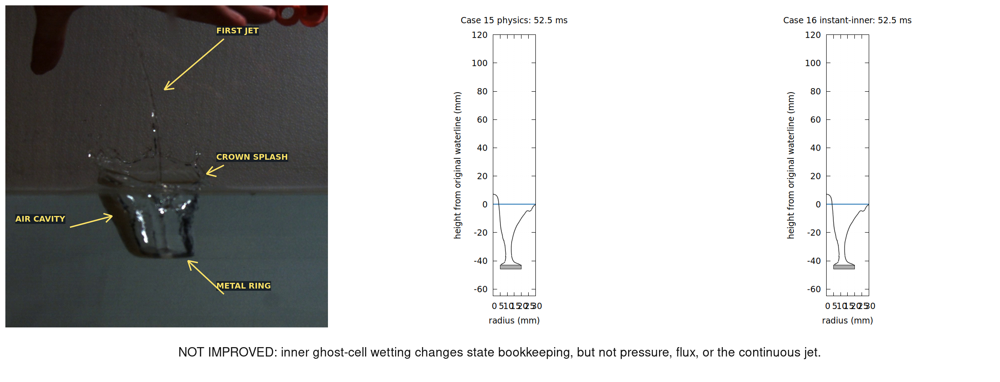
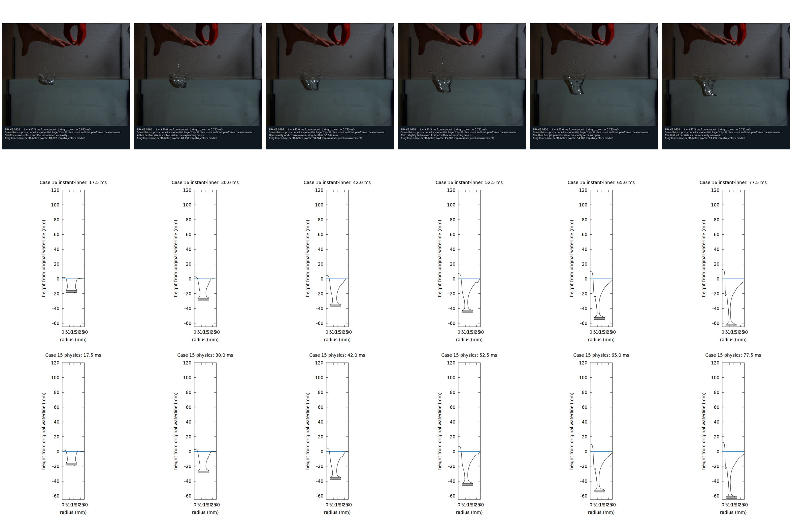
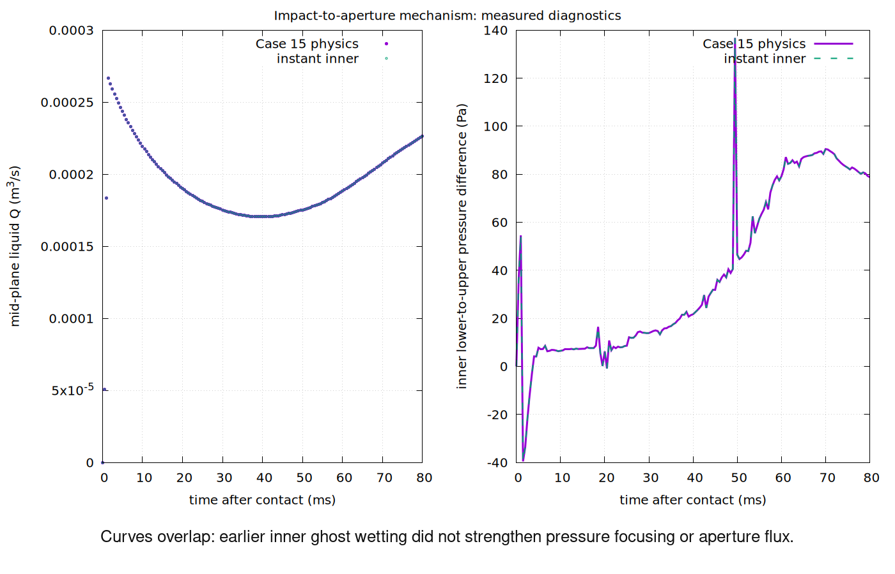
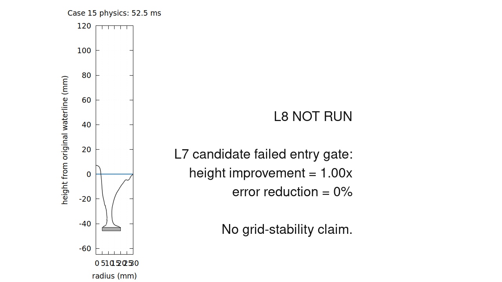
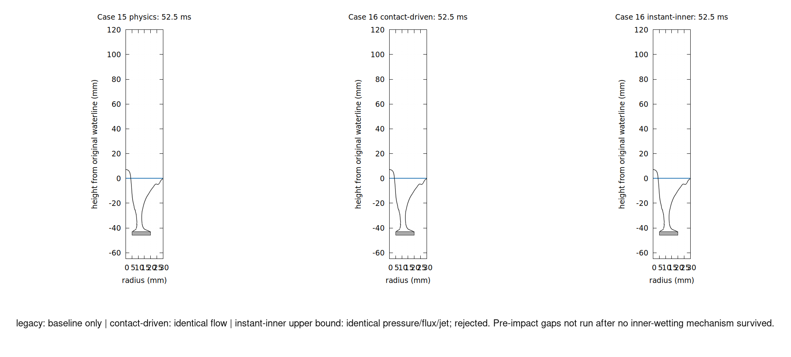

# Human review

如果只进行人工图片 review，请依次查看以下五张图。

Is the 52.5 ms jet visibly improved? **NO** — baseline and instant-inner PLIC
are identical and remain far below experiment.

Does a thin column appear on schedule? **NO** — CFD retains a broad low rise.

Is the 105.80 mm error reduced? **NO** — cell/PLIC heights remain
6.717/7.152 mm.

Did early inner ghost wetting increase focusing or Q? **NO** — curves overlap.

Are L7 and L8 similar? **UNCERTAIN** — L8 was correctly not run after gate
failure.

Were failures shown? **YES** — legacy/contact/instant outcomes are recorded;
pre-impact gaps are explicitly not run.

1. 30–42 ms centre column starts? **NO** — only a broad low rise.
2. 52.5 ms continuous thin jet? **NO** — connected but broad and short.
3. Clearly higher than Case 15? **NO** — metrics are byte-identical.
4. Thin and continuous at 65–77.5 ms? **NO** — broad rise persists.
5. Cavity still open? **YES** — PLIC remains open.
6. Isolated drop counted? **NO** — main-pool connectivity excludes it.
7. Crown counted as jet? **NO** — radius is aperture-restricted.
8. L7/L8 morphology similar? **UNCERTAIN** — L8 not run.
9. New large fragments? **NO**, though legacy morphology already disagrees.
10. Error truly reduced? **NO** — improvement is 0%.
