# Image Path Probe / 图片路径备查探测文件

本文件用于解决报告中 `D:\_COMSOL_FILE_SAVE_\COMSOL_Ring_Fountain\...` 本机绝对路径与 GitHub 仓库相对路径并存的问题。后续同事查图时应优先使用本文件中的仓库相对路径，避免把同一张图片误认为本机图片和 GitHub 图片两个不同版本。

## 路径换算规则

将本机前缀：

```text
D:\_COMSOL_FILE_SAVE_\COMSOL_Ring_Fountain\
```

替换为仓库根目录，并把反斜杠 `\` 改为斜杠 `/`。例如：

```text
D:\_COMSOL_FILE_SAVE_\COMSOL_Ring_Fountain\04_moving_ring_model\images\moving_ring_velocity_magnitude_spfU.png
```

对应 GitHub 仓库相对路径：

```text
04_moving_ring_model/images/moving_ring_velocity_magnitude_spfU.png
```

在本 `docs/` 文件内引用图片时，需要再加一层 `../`。

## 关键图像入口

完整机器可读表格见 [`image_path_probe.csv`](image_path_probe.csv)。下面按阶段展示主要图片。若某张图在 GitHub 页面无法显示，优先检查相对路径是否存在，而不要重新生成同名图片。

## Stage 4 代表性成果图

### moving-wall 速度大小场

- 本机绝对路径：`D:\_COMSOL_FILE_SAVE_\COMSOL_Ring_Fountain\04_moving_ring_model\images\moving_ring_velocity_magnitude_spfU.png`
- 仓库相对路径：`04_moving_ring_model/images/moving_ring_velocity_magnitude_spfU.png`
- 物理/审计含义：固定几何 moving-wall 模型中的速度大小场。
- 使用边界：单相固定几何模型，不能输出真实自由面喷泉高度。

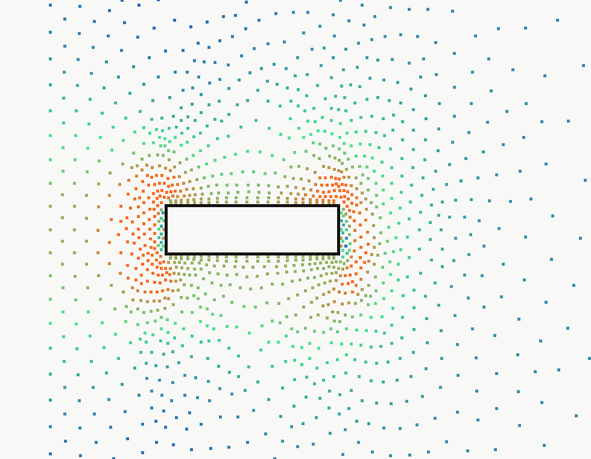

### moving-wall 压力场

- 本机绝对路径：`D:\_COMSOL_FILE_SAVE_\COMSOL_Ring_Fountain\04_moving_ring_model\images\moving_ring_pressure.png`
- 仓库相对路径：`04_moving_ring_model/images/moving_ring_pressure.png`
- 物理/审计含义：固定几何 moving-wall 模型压力场。
- 使用边界：单相模型，不能用于真实 `Hmax`。

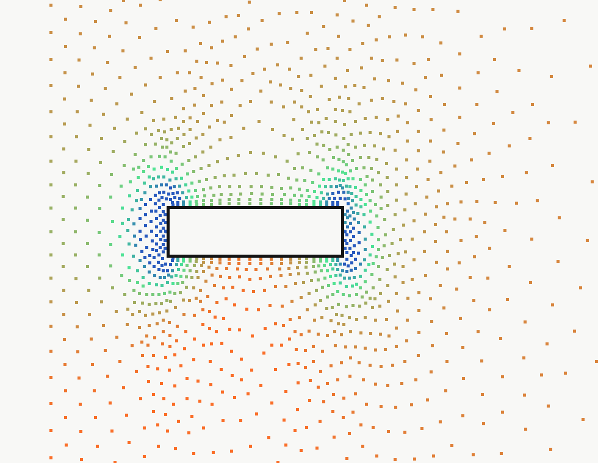

### moving-wall 轴向速度场

- 本机绝对路径：`D:\_COMSOL_FILE_SAVE_\COMSOL_Ring_Fountain\04_moving_ring_model\images\moving_ring_axial_velocity_w.png`
- 仓库相对路径：`04_moving_ring_model/images/moving_ring_axial_velocity_w.png`
- 物理/审计含义：轴向速度 `w` 场，用于检查中心孔上方竖直速度结构。
- 使用边界：单相模型。

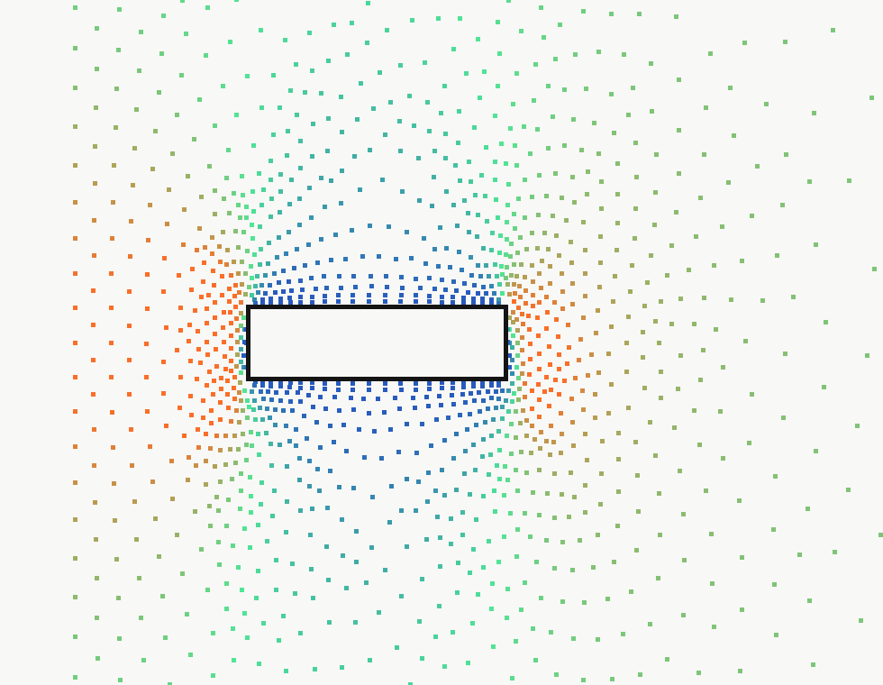

### 环附近速度矢量图

- 本机绝对路径：`D:\_COMSOL_FILE_SAVE_\COMSOL_Ring_Fountain\04_moving_ring_model\images\moving_ring_ring_near_velocity_vectors.png`
- 仓库相对路径：`04_moving_ring_model/images/moving_ring_ring_near_velocity_vectors.png`
- 物理/审计含义：用于核对环壁 moving-wall 边界附近速度方向。
- 使用边界：边界与速度方向审计图。

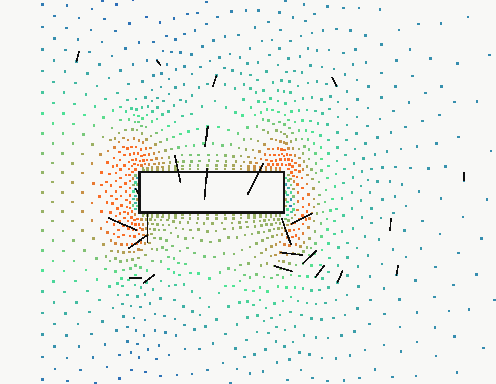

## Stage 5 smoke-test 图

### Stage 5A Level Set 静态界面烟测

- 本机绝对路径：`D:\_COMSOL_FILE_SAVE_\COMSOL_Ring_Fountain\05_two_phase_free_surface\images\5A_static_interface_final.png`
- 仓库相对路径：`05_two_phase_free_surface/images/5A_static_interface_final.png`
- 物理/审计含义：Level Set 变量 `phils` 的静态气-水界面烟测。
- 使用边界：烟测，不是环喷泉模型。

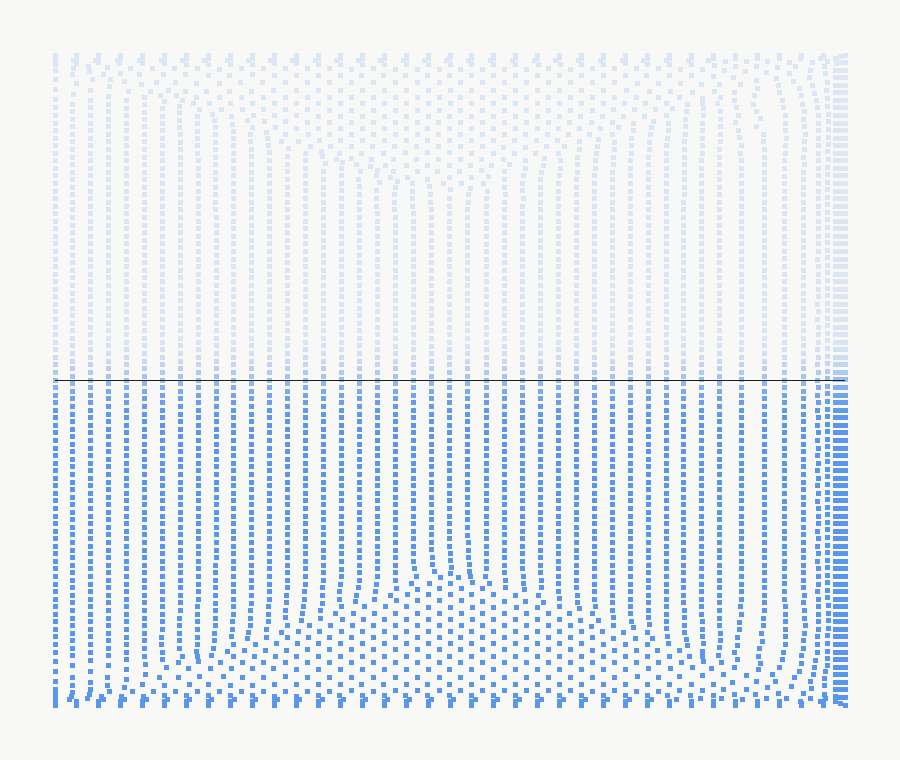

### Stage 5B2 phils 云图

- 本机绝对路径：`D:\_COMSOL_FILE_SAVE_\COMSOL_Ring_Fountain\05_two_phase_free_surface\5B2_static_ring_free_surface_smoke\images\5B2_1_phils_cloud_with_colorbar.png`
- 仓库相对路径：`05_two_phase_free_surface/5B2_static_ring_free_surface_smoke/images/5B2_1_phils_cloud_with_colorbar.png`
- 物理/审计含义：静态环自由面烟测中的 `phils` 云图。
- 使用边界：烟测，不是真实喷泉高度结果。

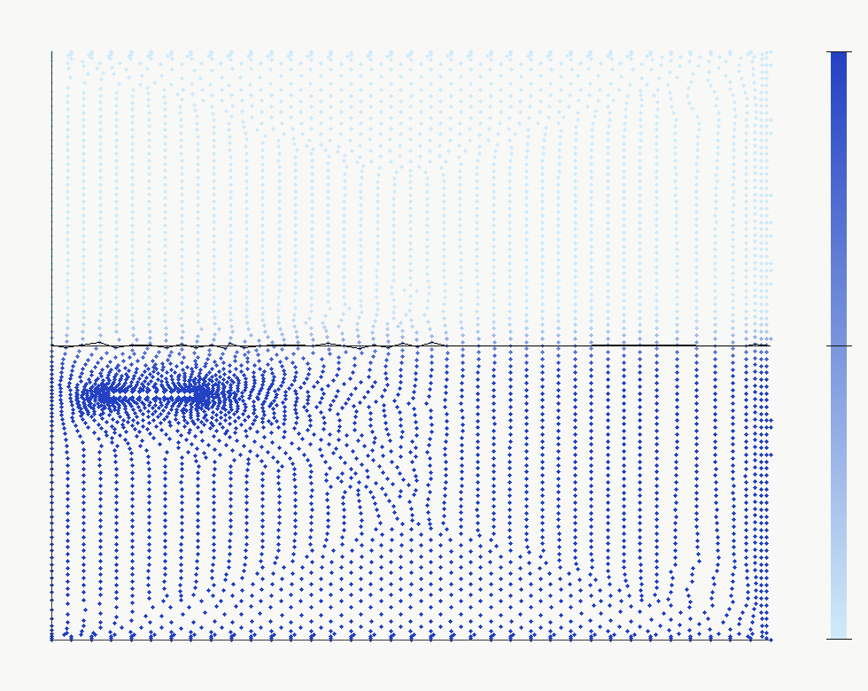

### Stage 5B2 密度场

- 本机绝对路径：`D:\_COMSOL_FILE_SAVE_\COMSOL_Ring_Fountain\05_two_phase_free_surface\5B2_static_ring_free_surface_smoke\images\5B2_1_density_rho.png`
- 仓库相对路径：`05_two_phase_free_surface/5B2_static_ring_free_surface_smoke/images/5B2_1_density_rho.png`
- 物理/审计含义：由 Level Set 混合函数得到的密度场。
- 使用边界：烟测。

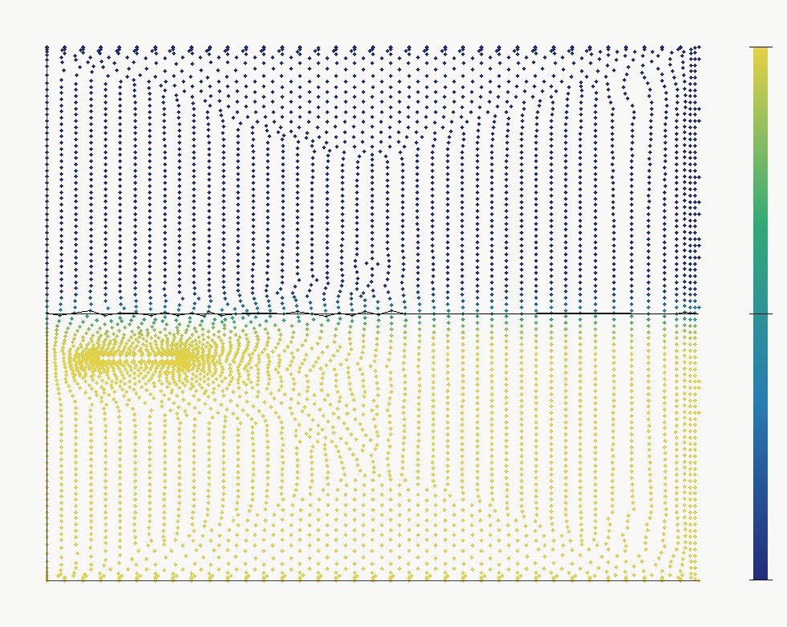

## Stage 5B4 / R1 诊断图

### D4 H(t) 诊断图

- 本机绝对路径：`D:\_COMSOL_FILE_SAVE_\COMSOL_Ring_Fountain\05_two_phase_free_surface\5B4_falling_or_equivalent_ring\images\D4_H_vs_t.png`
- 仓库相对路径：`05_two_phase_free_surface/5B4_falling_or_equivalent_ring/images/D4_H_vs_t.png`
- 物理/审计含义：D4 速度阶梯的界面高度诊断曲线。
- 使用边界：固定几何等效下落模型，不能作为真实喷泉 `Hmax`。

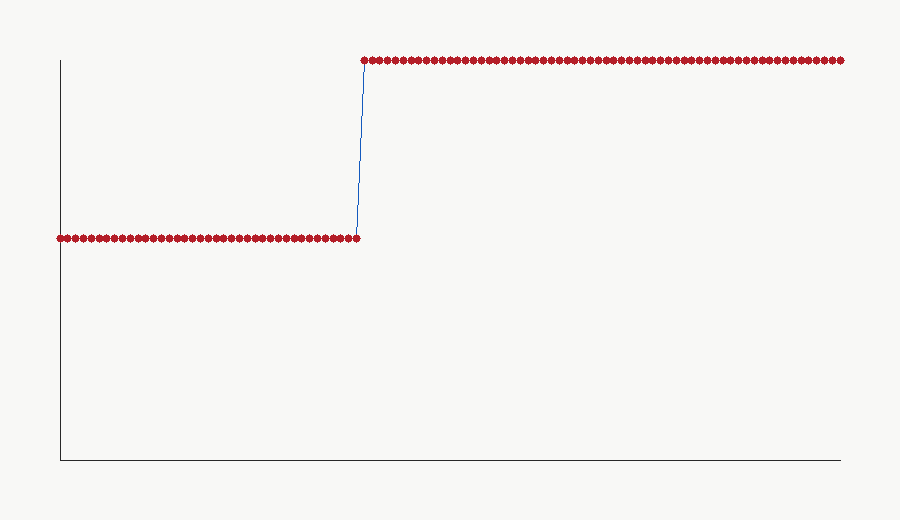

### R1 D4 repeat H(t) 诊断图

- 本机绝对路径：`D:\_COMSOL_FILE_SAVE_\COMSOL_Ring_Fountain\05_two_phase_free_surface\5B4_R1_extended_stability_repair\images\C_E0_D4_repeat_H_vs_t.png`
- 仓库相对路径：`05_two_phase_free_surface/5B4_R1_extended_stability_repair/images/C_E0_D4_repeat_H_vs_t.png`
- 物理/审计含义：5B4-R1 稳健诊断后的 D4 repeat 曲线。
- 使用边界：固定几何等效下落模型。

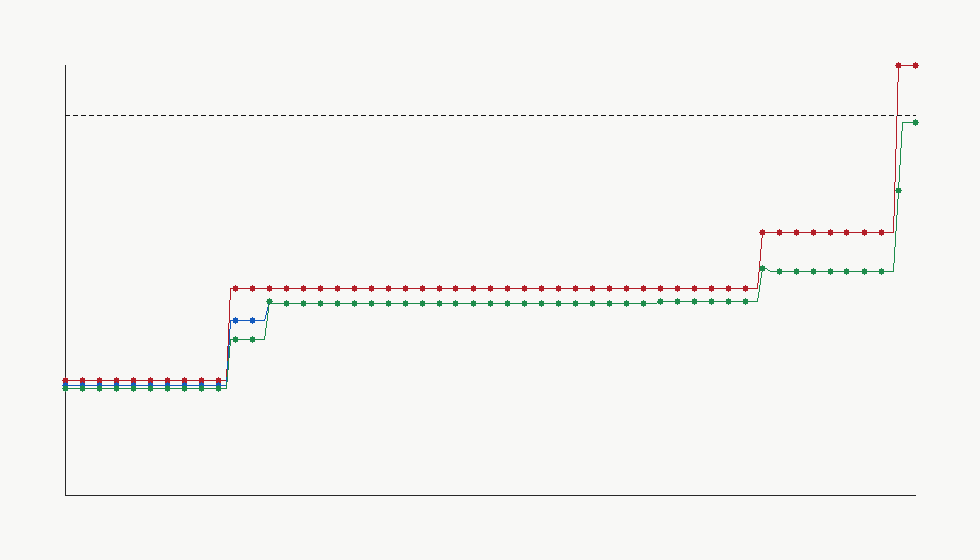

## R3 诊断图

### R2 关键指标导入复核图

- 本机绝对路径：`D:\_COMSOL_FILE_SAVE_\COMSOL_Ring_Fountain\06_true_moving_geometry_R3_ring_contactline_isolation\00_R2_import_review\images\R2_key_metrics_summary.png`
- 仓库相对路径：`06_true_moving_geometry_R3_ring_contactline_isolation/00_R2_import_review/images/R2_key_metrics_summary.png`
- 物理/审计含义：R2 指标导入与复核。
- 使用边界：诊断/门控证据。

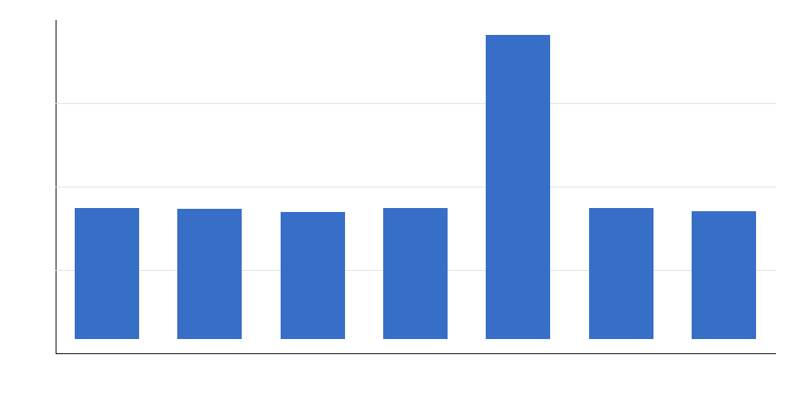

### R2 有环/无环控制组图

- 本机绝对路径：`D:\_COMSOL_FILE_SAVE_\COMSOL_Ring_Fountain\06_true_moving_geometry_R3_ring_contactline_isolation\01_R2_consistency_audit\images\R2_controls_ring_vs_no_ring.png`
- 仓库相对路径：`06_true_moving_geometry_R3_ring_contactline_isolation/01_R2_consistency_audit/images/R2_controls_ring_vs_no_ring.png`
- 物理/审计含义：有环与无环静态控制组比较。
- 使用边界：诊断/门控证据。

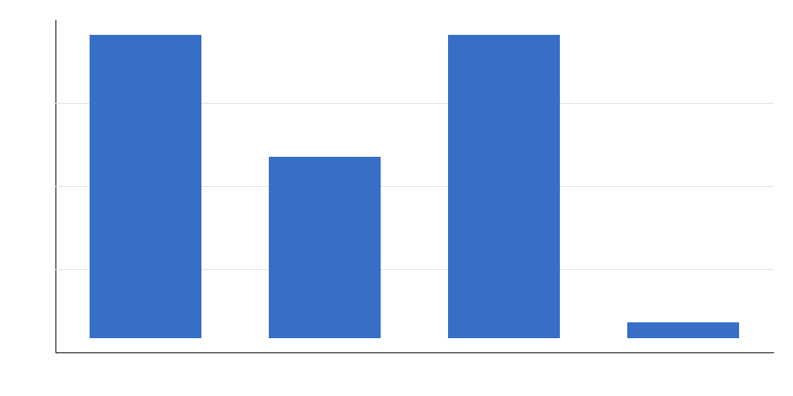

### R2 速度漂移关系图

- 本机绝对路径：`D:\_COMSOL_FILE_SAVE_\COMSOL_Ring_Fountain\06_true_moving_geometry_R3_ring_contactline_isolation\01_R2_consistency_audit\images\R2_D_drift_vs_velocity.png`
- 仓库相对路径：`06_true_moving_geometry_R3_ring_contactline_isolation/01_R2_consistency_audit/images/R2_D_drift_vs_velocity.png`
- 物理/审计含义：D 组速度与界面漂移/粗糙度诊断。
- 使用边界：诊断/门控证据。

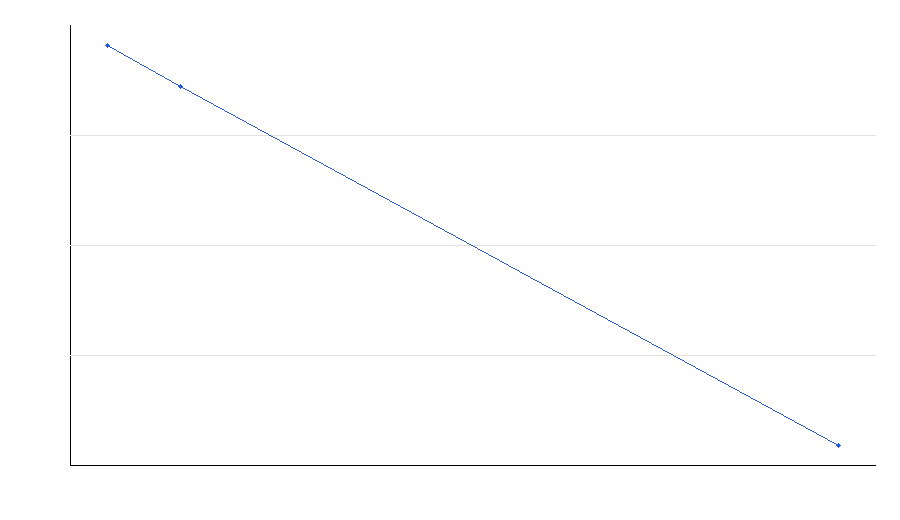

### 接触角控制汇总

- 本机绝对路径：`D:\_COMSOL_FILE_SAVE_\COMSOL_Ring_Fountain\06_true_moving_geometry_R3_ring_contactline_isolation\04_wettedwall_contactline_controls\images\wettedwall_contact_angle_summary.png`
- 仓库相对路径：`06_true_moving_geometry_R3_ring_contactline_isolation/04_wettedwall_contactline_controls/images/wettedwall_contact_angle_summary.png`
- 物理/审计含义：WettedWall 接触角控制组诊断汇总。
- 使用边界：诊断/门控证据。


## 完整相对路径清单

以下表格是主清单摘要；完整字段见 `image_path_probe.csv`。

| 阶段 | 类型 | 仓库相对路径 | 使用边界 |
|---|---|---|---|
| V0 checked | velocity / pressure / 3D | `01_v0_checked/images/*.png` | 单相基线，不是真实 `Hmax` |
| Stage 2.2 | parameter sweep plots | `02_2_clean_param_sweep/images/*.png` | 单相参数扫描中间指标 |
| Stage 3 | relative-flow plots | `03_relative_flow_model/images/*.png` | 固定环参考系近似 |
| Stage 4 | velocity/pressure/vectors/frames | `04_moving_ring_model/images/**/*.png` | 固定几何 moving-wall 单相模型 |
| Stage 5A | static interface smoke frames | `05_two_phase_free_surface/images/**/*.png` | Level Set 烟测 |
| Stage 5B2 | free-surface smoke images | `05_two_phase_free_surface/5B2_static_ring_free_surface_smoke/images/*.png` | 静态环烟测 |
| Stage 5B4/R1 | H(t) and phils diagnostics | `05_two_phase_free_surface/5B4*/**/images/*.png` | 固定几何等效下落诊断 |
| R3 | contact-line / roughness diagnostics | `06_true_moving_geometry_R3_ring_contactline_isolation/**/images/*.png` | true-geometry 前的诊断门控证据 |
